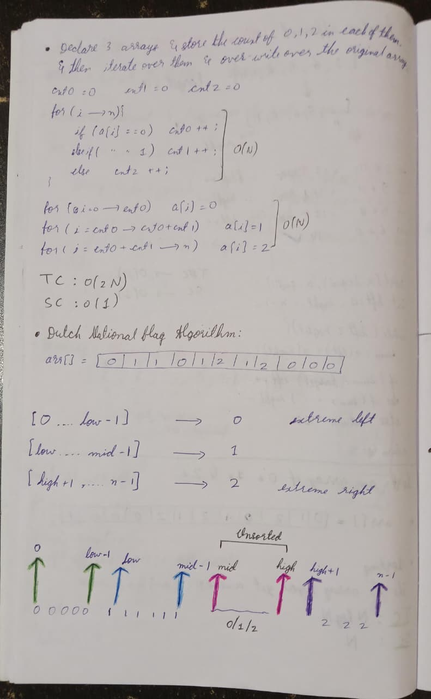

# 📊 Week 2 Summary Report
## 50-Day DSA Challenge Progress

**August 26 – September 2, 2025 | Arrays | Easy & Medium level questions**

---

## 🔥 Quick Snapshot

- **Days completed (cumulative):** 14 / 50  
- **Problems solved this week:** 11 (4 Easy, 7 Medium)  
- **Platforms:** LeetCode (primary)  
- **Topics focused:** Arrays (search, set ops, sliding-window, prefix-sum, XOR tricks, DNF, majority voting)

---

## 📅 Daily Progress
 

| Day | Topics Covered | Problems Solved |
|:---:|:---|:---|
| **1** | Linear scan & merge / set ops | Linear Search; Union of sorted array | 
| **2** | Sorted-array set intersection & run-length scans | Intersection of sorted array; Maximum consecutive 1's in an array |  
| **3** | Missing-elements & XOR frequency trick | Missing number in an array; Find the number that appears once while others appear twice | 
| **4** | Sliding-window (non-negative) & prefix-sum for negatives | Longest subarray with sum k (natural numbers); Longest subarray with sum k (zeros & negatives) | 
| **5** | Pair-sum patterns & Dutch National Flag | Sum of two numbers in array; Sort an array of 0's, 1's and 2's | 
| **6** | Frequency analysis / Majority voting | Majority element in the array | 
| **7** | Revision | - | 

---

## ❌ Mistakes I made (and fixes)

- **Confusing ordered vs unordered maps:** This made space/time reasoning messy.  
  - *Fix:* Re-read hash-map vs ordered-map behavior and practice a few examples to internalize differences.

- **Avoided built-ins (max/min) and overcomplicated solutions:** I used long if-else instead of simple built-ins.  
  - *Fix:* Practice idiomatic solutions and keep a cheatsheet of commonly used language built-ins.

- **Wrong study approach — binge-watching lectures then rewatching:** Rewatching multiple times after every failed attempt wasted time.  
  - *Fix:* Follow a structured plan. Watch a short concept video, attempt the problem, then read editorial only after a focused struggle.

- **Attempting problems after watching lectures:** I lost the valuable learning gained from first-principles struggle.  
  - *Fix:* Code first. If stuck for 30–45 mins, then watch the lecture or editorial, and re-implement from memory.

---

## Best page of the week 📜

This small diagram effectively explains the **Dutch National Flag algorithm**.

---

## 🚀 Week 3 Preview

**🎯 Focus:** Finish more Medium problems and attempt first Hard problems  
**📚 Problems:** Arrays (deeper variants, edge cases)  
**🎪 New Challenges:** Attempting Hard questions for the first time

---

## 🔗 Repository

**All Solutions:** [DSA Challenge Notes](https://github.com/Khizar-hayath/DSA-Challenge-Notes)  
**Next Report:** Week 3 Summary (September 9, 2025)

---

*"I never thought I could make it this far. Now it's time to increase the intensity!"*

**Onward to Week 3! 📈**

