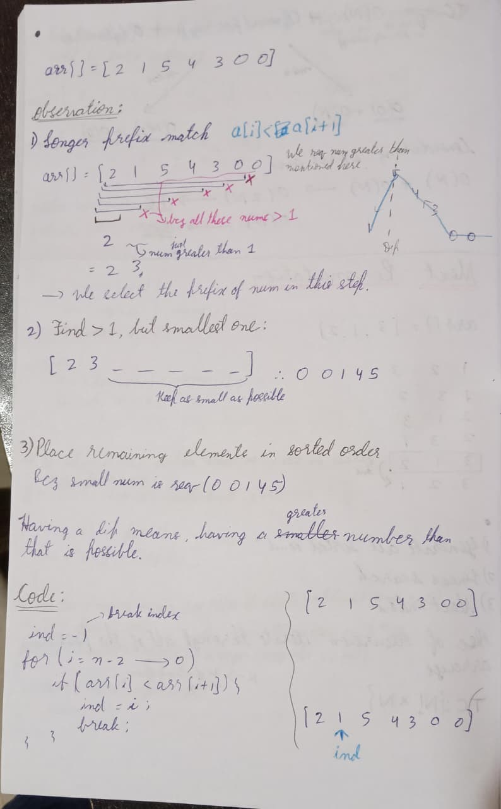

# 📊 Week 3 Summary Report
## 50-Day DSA Challenge Progress

 

**September 2 – September 9, 2025 | Arrays | Medium level questions**

It was a slow week. Next week not gonna be this slow!  

---

##  Quick Snapshot 🔥

- **Days completed (cumulative):** 21 / 50  
- **Problems solved this week:** 08 (4 Easy, 4 Medium)  
- **Platforms:** LeetCode (primary)  
- **Topics focused:** Kadane’s & greedy stock, rearrangements, next permutation, leaders, equalization
---

## Best page of the week 📜

This small diagram effectively explains the logic for the problem **Next permutation**.

---

## Mistakes I made ❌

- **Not using sets for optimal solution:** Seaching trough sets take way less time than searching them linearly.
- **Taking break everyday to relax mind:** It was reqired I suppose (Maybe not a mistake)

- Many of the silly mistakes have been eliinated till now

---

## Daily Progress 📅
 

| Day | Topics Covered | Problems Solved |
|:---:|:---|:---|
| **1** | Greedy buying/selling & Kadane’s algorithm | Buy and sell stocks; Maximum Subarray Sum |  
| **2** | Rearrangement by signs (two-pointer & partition logic) | Rearrange Array Elements by Sign (unequal elements); Rearrange Array Elements by Sign (equal elements) |  
| **3** | Lexicographic ordering & array transformations | Next permutation |  
| **4** | Right-to-left scans & leader identification | Leaders in an array |  
| **5** | Hashing + set operations & transformation minimization | Longest consecutive sequence; Minimum Operations to Equalize Array |  
| **6** | Rest | - |  
| **7** | Revision | - |  

---

## Week 3 Preview 🚀 

**Focus:** Complete Arrays topic  
**Problems:** Arrays (Remaining types)  
**New Challenges:** Attempting Hard questions for the first time

---

## 🔗 Repository

**All Solutions:** [DSA Challenge Notes](https://github.com/Khizar-hayath/DSA-Challenge-Notes)  
**Next Report:** Week 4 Summary (September 16, 2025)

---

*"I surely made it so far with consistency. I realised my efficiency is too low! Gotta work on that"*

**Onward to Week 4! 📈**

