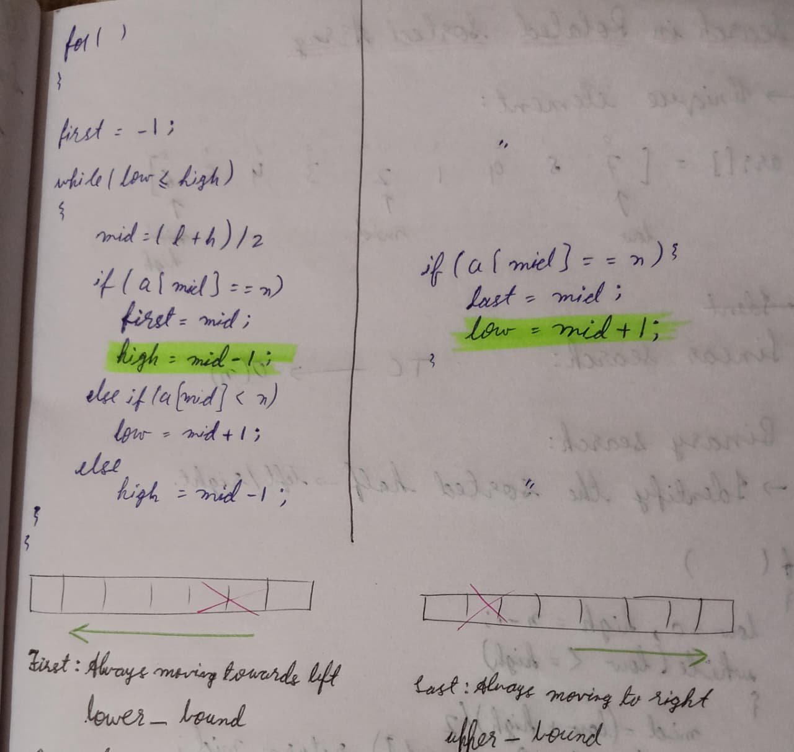

# Week 6 Summary Report
## 50-Day DSA Challenge Progress

<div align="center">


</br>


**Binary Search | BS on 1D Arrays**

</div>
<br>

---

## Daily Progress 📅

| Day | Topics Covered | Problems Solved | Key Learning |
|:---:|:---|:---|:---|
| **36** | Binary Search Basics | Binary Search implementation | Search space reduction |
| **37** | Bounds & Boundaries | Upper Bound, Lower Bound | Finding insertion points |
| **38** | Position Finding | Search Insert Position, Floor and Ceil | Binary search variations |
| **39** | Range Search | First and Last Position in Sorted Array | Modified binary search |
| **40** | Rotated Arrays | Search in Rotated Array I & II | Pattern recognition in rotation |
| **41** | Minimum Finding | Find Minimum in Rotated Sorted Array | Pivot point detection |
| **42** | Review | Revision of all Binary Search concepts | - |

---

## Best page of the week 📜



``` Code explaining first and last occurance of x in an array.```

## Quick Snapshot 🔥

I started Binary Search this week. It has been really great after last week of distractions from multiple hackathons. Binary Search has been quite easy upto now!

---

## **Breakthroughs** 💡

- Was able to solve many of the problems on my own.
- Maintained really good consistency without any distractions.

<br>

---

## Key Learnings  🎓

- Whenever sorted alements are mentioned, check wheather it has anything to do with Binary Search.
- Majority of the code is just same with really minor adjustments. 

<br>

---

## Week 7 Preview

**Focus**: Advanced Binary Search Applications  
**Upcoming**: More complex search problems, optimization techniques  
**Goal**: Master advanced binary search patterns and variations

---

## Repository 🔗

**All Solutions**: [DSA Challenge Notes](https://github.com/Khizar-hayath/DSA-Challenge-Notes)  
**Next Report**: Week 7 Summary (March 9, 2025)

---

<div align="center">

*"Binary search felt natural and easier than topics before, and that's the beauty of this journey!"*

**📈 6 weeks down, momentum is strong!!**

</div>